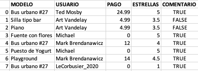
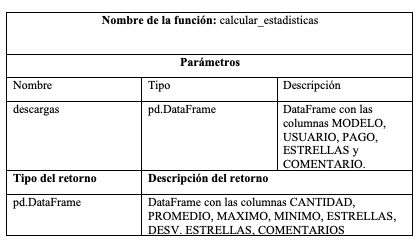

# Estadísticas de descargas

## Descripción del problema

Una plataforma web que vende y distribuye modelos tridimensionales
para su uso en proyectos de arquitectura tiene información sobre cada
venta que han tenido los modelos publicitarios. A partir de esa
información, ellos quieren que tú los ayudes a calcular estadísticas
sobre cada modelo.

Tu tarea será construir la función calcular_estadisticas que recibe
un DataFrame con la información de las descargas y retorna un DataFrame
con las estadísticas.

El DataFrame de entrada tendrá una fila con la información de cada
descarga: el nombre del modelo descargado, el nombre del usuario que la
descargó, el dinero en dólares que pagó por el modelo (número decimal),
la cantidad de estrellas (entre 1 y 5) que el usuario le dio al modelo
(número decimal) y si dejó o no un comentario sobre el modelo después de
haberlo descargado (valor booleano). El precio de un modelo particular
podría ser diferente entre descargas porque la plataforma suele hacer
promociones y porque los artistas que los crean pueden modificar el
precio cuando ellos quieran. El precio podría ser 0 en algunas
descargas, pero esos registros no se deberá tener en cuenta.

El siguiente es un ejemplo de un DataFrame que muestra los nombres
de las columnas y posibles valores que puede haber en el DataFrame.

<!---
|   | MODELO          | USUARIO         |PAGO |ESTRELLAS|COMENTARIO|
|---|:----------------|:----------------|----:|--------:|:--------:|
|0  |Bus urbano #27   |Ted Mosby        |24.99|        5|   TRUE   |
|1  |Silla tipo bar   |Art Vandelay     | 4.99|      3.5|   FALSE  |
|2  |Piano            |Art Vandelay     | 4.99|      3.5|   FALSE  |
|3  |Fuente con flores|Michael          |    0|        5|   TRUE   |
|4  |Bus urbano #27   |Mark Brendanawicz|   12|        4|   TRUE   |
|5  |Puesto de yogurt |Michael          |    0|        5|   TRUE   |
|6  |Playground       |Mark Brendanawicz|   14|      4.5|   TRUE   |
|7  |Bus urbano #27   |LeCorbusier_2020 |    0|        1|   TRUE   |
-->

El DataFrame que retorna la función tiene que tener una fila por cada
modelo. El DataFrame tendrá 7 columnas: CANTIDAD, que tendrá un número
entero con la cantidad de descargas que haya tenido el modelo; PROMEDIO,
que tendrá un número decimal con la cantidad promedio que se pagó por
el modelo; MAXIMO que tendrá un número decimal con la cantidad máxima
que se pagó por el modelo; MINIMO que tendrá un número decimal con la
cantidad mínima que se pagó por el modelo; ESTRELLAS, que tendrá un
número decimal con la cantidad promedio de estrellas que se le dio al
modelo; DESV. ESTRELLAS, que tendrá un número decimal con la desviación
estándar de la cantidad de estrellas que se le hayan dado al modelo; y
COMENTARIOS, que tendrá un número entero con la cantidad de
comentarios que hayan dejado los compradores.

_Notas importantes sobre el DataFrame resultado_:

1. El índice del DataFrame tendrá los nombres de los modelos y sólo
  deben aparecer aquellos para los que al menos un usuario haya pagado. Es
  decir que no deben   aparecer los modelos que hayan sido siempre
  gratuitos.

2. Los modelos deben aparecer en orden alfabético de acuerdo a su nombre.

3. Todos los números que no sean enteros deben aparecer redondeados a
  dos cifras decimales.

4. Como la desviación estándar no se puede calcular cuando haya sólo
  un dato, en lugar de NaN debe aparecer 0.0 en el resultado.

El siguiente es el ejemplo del DataFrame con las estadísticas calculado a
partir del DataFrame de descargas mostrado arriba:

<!---
|               |CANTIDAD|PROMEDIO|MAXIMO|MINIMO|ESTRELLAS|DESV. ESTRELLAS|COMENTARIOS|
|:--------------|-------:|-------:|-----:|-----:|--------:|--------------:|----------:|
|MODELO         |        |        |      |      |         |               |           |
|Bus urbano #27 |       2|   18.49| 24.99|    12|        5|           0.71|          2|
|Piano          |       1|    4.99|  4.99|  4.99|      3.5|              0|          0|
|Playground     |       1|      14|    14|    14|      4.5|              0|          1|
|Silla tipo bar |       1|    4.99|  4.99|  4.99|      3.5|              0|          0|
-->

## Función requerida

Tu solución debe tener una función de acuerdo con la siguieten especificación.

Si lo requieres, puedes agregar funciones adicionales.