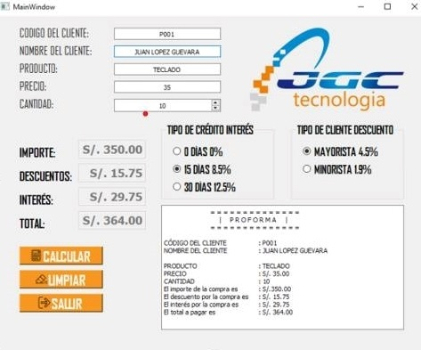

# Enunciado Original

Elabore el siguiente formulario que permita calcular el importe,
descuentos según el tipo de cliente, los intereses según el tipo
de crédito, darle funcionalidad a los botones calcular, limpiar
y salir.

