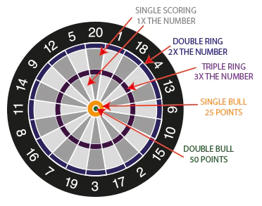

# Descripción del Juego

<p align="center"></p>

En un torneo de dardos, dos jugadores lanzan alternadamente 3 dardos
cada uno a un blanco circular. En la periferia del círculo hay 20
números asociados a la puntuación que genera un dardo en cada sector
del blanco. Un sector está dado por el segmento asociado al número,
pero hay un multiplicador que depende de qué parte dentre de ese sector
cae el dardo. La figura muestra que un dardo en el primer anillo
delgado multiplica por dos y uno en el segundo anillo delgado
multiplica por 3. Finalmente hay dos situaciones especiales que
corresponden al centro mas pequeño (double bull) y al centro mas grande
(single bull) que otorgan un puntaje de 50 y 25 puntos respectivamente.
Si el dardo cae en la zona negra o fuera del blanco el puntaje es cero.

Hay otro aspecto del juego que lo hace más interesante. Los jugadores
parten siempre con un puntaje de 501 puntos y los puntajes obtenidos
con sus lanzamientos restan puntos a esta suma. Si un jugador logra
llegar a cero gana el torneo pero ojo que debe llegar en forma exacta a
cero. Si un jugador tiene 30 puntos y sus últimos 3 dardos suman 45, al
restar los 45 de los 30 quedaría en -15 que cambian a 15 puntos.

# Descripción del Programa

Primeramente, se pide el nombre de los dos jugadores y se toman las 3
primeras letras en mayúsculas para identificarlo en adelante. Si las 3
letras del segundo jugador quedan iguales a las del primero agregar un
número 2 al segundo. Se asigna a cada uno de ellos sus 501 puntos y el
programa imprime el resultado de puntajes:

```code
Ingrese los nombres de los jugadores: Marcela Marta
MAR 501
MAR2 501
```

A continuación, se ingresan los 3 lanzamientos de Marcela seguidos de
los 3 lanzamientos de Marta en el siguiente formato:

puntaje multiplicador\
SINGLE BULL\
DOUBLE BULL\
NULL

Por ejemplo, podemos ingresar la siguiente jugada:

```code
DOUBLE BULL
3 20
3 19
SINGLE BULL
2 20
3 20
```

En este caso Marcela habría obtenido 50 en su primer lanzamiento, 60 en
el segundo y 57 en el tercero con un total de 167 puntos quedando con
501 - 167 = 334 puntos.

Marta habría obtenido 25 en su primer lanzamiento, 40 en el segundo y 60
en el tercero con un total de 125 puntos quedando con 501 - 125 = 376
puntos.

El programa debe responder entonces con:

```code
MAR 334
MAR2 376
```

Para simplificar las pruebas del programa la interacción es muy simple
y se ilustra en el ejemplo siguiente. Como se puede observar luego de
que el programa imprime los puntajes se debe ingresar el detalle de los
3 lanzamientos del primer jugador seguido de los 3 lanzamientos del
segundo. Lo que imprime el programa está en negrita. Cualquier error en
el formato de los lanzamientos se indica y el programa termina.

# Ejemplo de uso

```code
Ingrese los nombres de los jugadores: Cristobal Valentin
CRI 501
VAL 501

DOUBLE BULL 
3 20
3 19
SINGLE BULL 
2 20
3 20

CRI 334
VAL 376

NULL
2 19
1 5
DOUBLE BULL
3 9
3 11

CRI 291
VAL 266

3 10
2 20
NULL
1 7
2 17
DOUBLE BULL

CRI 221
VAL 175

3 20
3 20
DOUBLE BULL
DOUBLE BULL
3 19
3 10

CRI 51
VAL 38

SINGLE BULL
1 17
3 9
2 3
1 17
3 5

CRI 18
VAL 0
Gana Valentín! Felicitaciones.
```

