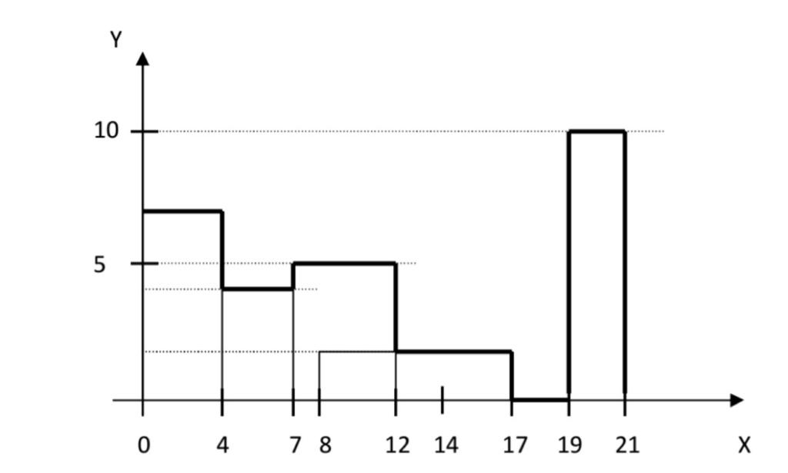

Sobre un eje de coordenadas positivo se tiene representados edificios en forma
rectángulos. Cada rectángulo descansa sobre el eje horizontal y se representan
por sus abscisas inicial y final y por su altura. La línea de horizonte es el
contorno que forman los edificios.

Implemente un algoritmo orientado a objetos que permita ingresar una ciudad
conformada por N edificios y muestre como salida gráficamente la línea de
horizonte que forma un conjunto de edificios, así como el área y el perímetro
de cada uno de ellos.

Ej:
Una ciudad:

    C = ((0, 4, 7), (4, 7, 4), (7, 12, 5), (8, 17, 2), (17, 19, 0), (19, 21, 10))

- La primera cifra es el eje de abscisas inicial, es decir, donde empieza el rectángulo
  del edificio.
- La segunda cifra es el eje de abscisas final, es decir, donde finaliza el rectángulo
  del edificio.
- La última cifra es la altura del edificio.

