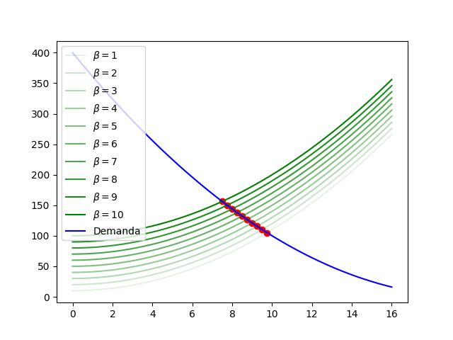

Resolver el siguiente problema sin utilizar clases, sólo usando
funciones. Considere las ecuaciones de oferta y demanda:
$$S(q) = q^2 + \beta *10$$
$$D(q) = (q - 20)^2$$

El objetivo es crear un gráfico que muestre la demanda y la oferta
para 10 valores de β ∈ [1, 10]. En clases vimos que podemos solucionar este
equilibrio con `eq = sy.Eq(S(q), D(q))` y `q_sol = sy.solve(eq)`.
Ahora, la idea es usar `for` para iterar sobre 10 valores de β y
graficar las ofertas y los puntos de equilibrio (cantidad, precio).
Aproveche el `for` para cambiar la intesidad de color de cada curva
de oferta (por ejemplo, a menor valor de β menor intensidad de color).

>__**NOTA**__
> El enunciado depende mucho del trabajo que se realizó previamente
> junto al instructor, no se tiene datos adicionales; por lo tanto,
> la solución puede (o no) usar implementaciones que la persona que
> solicita la ayuda no ha visto antes.

---

